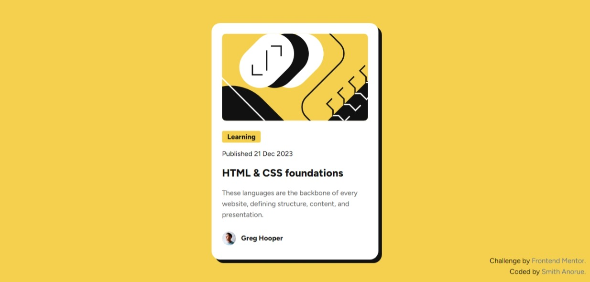

# Frontend Mentor - Blog preview card solution



This is a solution to the [Blog preview card challenge on Frontend Mentor](https://www.frontendmentor.io/challenges/blog-preview-card-ckPaj01IcS). Frontend Mentor challenges help you improve your coding skills by building realistic projects. 

## Table of contents

- [Overview](#overview)
  - [The challenge](#the-challenge)
  - [Screenshot](#screenshot)
  - [Links](#links)
- [My process](#my-process)
  - [Built with](#built-with)
  - [What I learned](#what-i-learned)
  - [Continued development](#continued-development)
  - [Useful resources](#useful-resources)
- [Author](#author)

## Overview

This shows my previews and experience while building the project.

### The challenge

Users should be able to:

- See hover and focus states for all interactive elements on the page
- Check the responsiveness of the page across screens

### Screenshot

[Screenshot Desktop-view](./screenshots/screenshot-desktop.jpeg)
[Screenshot Mobile-view](./screenshots/screenshot-mobile.png)

### Links

- Solution URL: [My Solution](https://your-solution-url.com)
- Live Site URL: [Live Site](https://html-preview.github.io/?url=https://github.com/OldAssassin24/Frontend_Mentor/blob/main/blog-preview-card-main/index.html)

## My process

This section highlights the process I took towards completing the challenge.

### Built with

- Semantic HTML5 markup
- CSS

### What I learned

There are two things I learnt from this challenge:
- Semantic HTML5 Markup
- CSS media query

For the first one, it wasn't much of a challenge as it wasn't difficult in the slightest. The only problem I'd say I faced was the part where I wasn't sure if I could just go with a specific tag I wanted to use or if I was to go with the full process. Here's a sample:
```html
...
<header></header>
<nav></nav>
<article>
  <section><!--Some Random Code--></section>
</article>
<aside></aside>
<footer></footer>
...
```
This was what I thought I was meant to do, but after asking in the Discord channel, I found out that I don't need to follow this long 😂 process and I can just start where ever I please, I just needed to add a `main` tag:
```html
...
<main>
  <article>
    <section><!--Some Random Code--></section>
  </article>
</main>
...
```
As for the `media` query, this one took me a while to master this one, asked a couple of times on the net, but I eventually got the hang of it.

### Continued development

Now that I have learnt "Semantic HTML5 markup", all that's left for now are:
- Tailwind, Vanilla or Bootstrap
- ReactJS

These should be easy 😁

### Useful resources

- [Discord](https://discord.gg/UAfh3qzhYb) - This helped me a lot in semantic HTML5. I really liked the community, quick response, always redy to help and friendly too. Make sure you join as well, the answers might be closer than you think.

## Author

- Name - Smith Anorue
- Frontend Mentor - [@OldAssassin24](https://www.frontendmentor.io/profile/OldAssassin24)
- Twitter - [@OldAssassin2](https://www.twitter.com/OldAssassin2)
