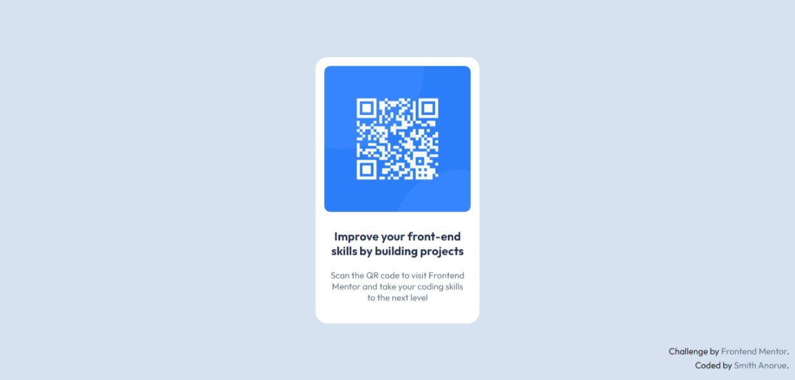
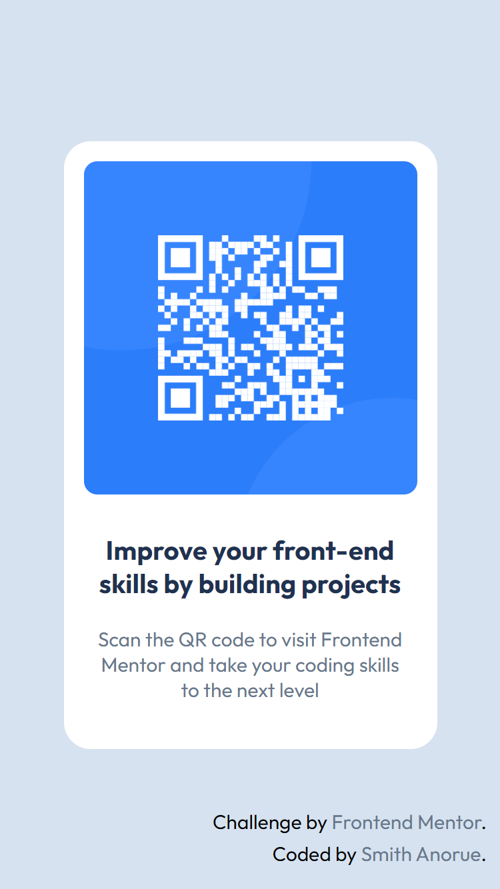

# Frontend Mentor - QR code component solution



This is a solution to the [QR code component challenge on Frontend Mentor](https://www.frontendmentor.io/challenges/qr-code-component-iux_sIO_H). Frontend Mentor challenges help you improve your coding skills by building realistic projects. 

## Table of contents

- [Overview](#overview)
  - [Screenshot](#screenshot)
  - [Links](#links)
  - [Built with](#built-with)
  - [What I learned](#what-i-learned)
  - [Continued development](#continued-development)
  - [Useful resources](#useful-resources)
- [Author](#author)
- [Acknowledgments](#acknowledgments)

## Overview

This shows my previews and experience while building the project.

### Screenshot

- 
- 

### Links

- Solution URL: [Add solution URL here](https://your-solution-url.com)
- Live Site URL: [HTML Preview](https://html-preview.github.io/?url=https://github.com/OldAssassin24/Frontend_Mentor/blob/main/QR-CODE-COMPONENT/qr-code-component-main/index.html)

I couldn't create an account on Vercel and Netlify for some reason 🤷‍♀️😫, so I just used this one.
### Built with

- HTML5 markup
- CSS


### What I learned

If there's anything I learnt, it that I finally learnt how to use online fonts.
I always had issues with online fonts cause no matter what I did, it always didn't work,
so I would just download the fonts instead.

All I just needed to do was this:
```html
  <link rel="preconnect" href="https://fonts.googleapis.com">
  <link rel="preconnect" href="https://fonts.gstatic.com" crossorigin>
  <link href="https://fonts.googleapis.com/css2?family=Outfit:wght@100..900&display=swap" rel="stylesheet">
```

I don't actually remember what made stuck here to be honest 😅
It's so easy.

Also, I did this without using the Figma file, wanted to put myself to some hard training 💪

### Continued development

I want to learn more things, but the most pressing is:

- Semantic HTML
- ReactJS
- Tailwind, Vanilla or Bootstrap

I'll learn these and many more as I'm working on projects, who knows, it might be as easy as the online fonts 😁

### Useful resources

There are a lot of places where you can get useful information, but I prefer:

- [GeeksforGeeks](https://www.geeksforgeeks.org)

## Author

- Name - Smith Anorue
- Frontend Mentor - [@OldAssassin24](https://www.frontendmentor.io/profile/OldAssassin24)
- Twitter - [@OldAssassin2](https://www.twitter.com/OldAssassin2)

## Acknowledgments

I want to encourage you to always try to ask questions, there are a lot of online forums that can help you in your journey, so don't be like me and end up wasting your time on something that can be solved easily, and lastly, never stop learning!
